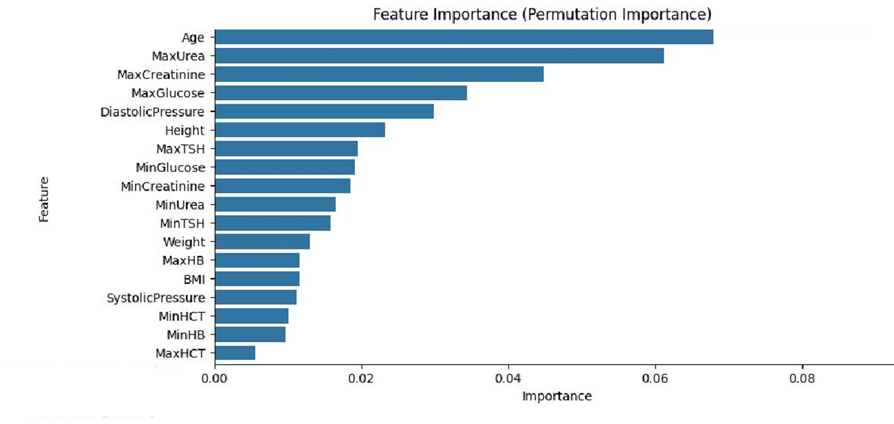

<p align="center">
  
</p>

# URgent: Predicting Urgent Diabetic Retinopathy Cases with ML 🧠

Machine learning model to predict urgent diabetic retinopathy cases from medical records. Helps prioritize high-risk patients, reduce wait times, and support smarter healthcare decisions.

---

## 📌 Overview

Due to long wait times for diabetic eye screening, urgent retinal conditions are often diagnosed too late. The **URgent** project aims to identify high-risk patients early using structured medical data and machine learning.

This repository outlines the full ML pipeline and decisions taken during the project. **Note:** Due to privacy regulations, code and data are not publicly shared. However, this documentation provides a comprehensive overview of the approach, modeling, and insights.

---

## 🩺 Problem Statement

- Up to **3-year delays** for diabetic retinopathy screening
- No system for **automated prioritization**
- **Manual triaging** of medical records is not scalable

**Goal:** Predict whether a diabetic patient has **urgent retinal findings** requiring prompt attention.

---

## 🧪 Dataset and Preprocessing

Each patient was associated with multiple time-stamped test records (PID-based). For modeling:
- Only the **most recent exam** per patient was used
- Removed uninformative fields like `"DIABETES"` or those with excessive missing data
- Imputed missing values appropriately
- Performed **class balancing**, especially for underrepresented `label 2` (urgent cases)
- Selected only the most clinically relevant features after exploratory and domain analysis

---

## 🎯 Target Classes

- `0`: Normal
- `1`: Clinically significant
- `2`: **Urgent clinical finding** (critical prediction target)

---

## 🤖 Modeling Pipeline

- Classifier: `RandomForestClassifier`
- Hyperparameter tuning via `GridSearchCV`
- Evaluation metric: `macro_recall` (sensitive to minority class performance)
- Feature importance via **permutation analysis**
- Explainability via **SHAP**

**Final optimized hyperparameters:**
```
{
'n_estimators': 500,
'max_depth': None,
'min_samples_split': 2,
'min_samples_leaf': 1,
'max_features': 'sqrt',
'criterion': 'gini',
'bootstrap': False,
'max_samples': None,
'class_weight': 'balanced',
'max_leaf_nodes': None,
'min_weight_fraction_leaf': 0.0,
'warm_start': True
}
```

---

## 📈 Results

| Metric         | Score  |
|----------------|--------|
| Accuracy (CV)  | 0.8537 |
| Macro Recall   | 0.8555 |
| Macro Precision| 0.8537 |

We also achieved 0.96 recall on case 2 (critical prediction target)

---

## 🔍 Feature Importance

The model identified the following key predictors:

<p align="center">
  
</p>

Top features:
- Age
- Max Urea
- Max Creatinine
- Max Glucose
- Diastolic Pressure

---

## 🛡️ Note on Data Privacy

Due to medical privacy constraints, the **code and datasets cannot be publicly shared**. This repository serves as a **conceptual showcase** of the full ML workflow, including:

- Problem framing  
- Preprocessing logic  
- Feature selection  
- Model evaluation and explainability

---

## 🧠 Skills Demonstrated

- Healthcare-oriented ML modeling  
- Data wrangling from structured hospital databases  
- Imbalanced classification with class-aware metrics  
- Model explainability using feature importance 
- Hyperparameter tuning and cross-validation

---

## 📌 Future Work

- Expand to multi-modal data (e.g., imaging + tabular)
- Real-time risk dashboard integration
- Deploy model as clinical decision support API


